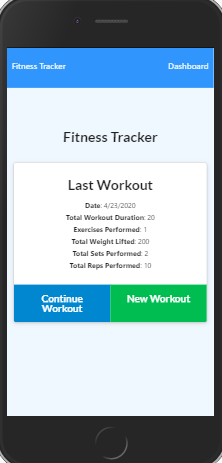
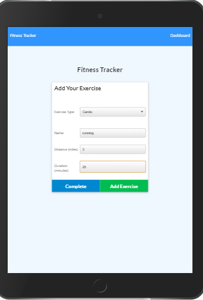

# KCTracker

An exercise app that tracks your chosen exercises on a weekly basis and logs them by day.  

 ## Description: 
 This App utilizes MongoDB/Mongoose and uses Robo3T(open source-MongoDB GUI) along with Express for routing.

 
 ## Table of Contents: 
  * Instructions
  * Installation 
  * Requirements
  * License 
  * Contributing 
  * Questions 
  * Images 

   #### Instructions:

   1. Click on "New Workout" or "Continue Workout".
   2. "New" will allow you to add a new exercise.  Click complete when you are done.
   3. "Continue" will allow you to add to your most recent exercise program.  Click complete   when you are done.
   4. Click on "Dashboard" to see your progress "Stats".
   5. Click on "Fitness Tracker" to go back to the main page.

   #### Installation: 

   npm install
   
   ### Requirements: 

   * [Node.js] (https://nodejs.org/en/)
   * [MongoDB] (https://mongodb.com)
   * [Robo3T] (https://robomongo.org/)
   * NPM Packages:
        * [Express] 
        * [Mongoose]
         

   
   #### License: 

   ISC: 
   
   ### Contributions: Karna Cutolo

   
   ### Questions: 
      
   #### If you have any questions about this repo, please reach out: 

   **Email: karna.cutolo@gmail.com**
     
   #### Images:

**Main Page**

**Add an Exercise**

